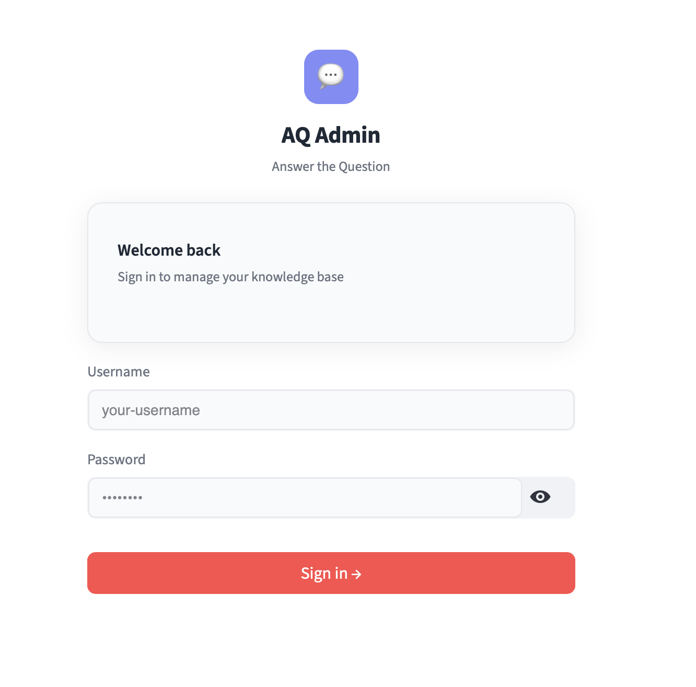
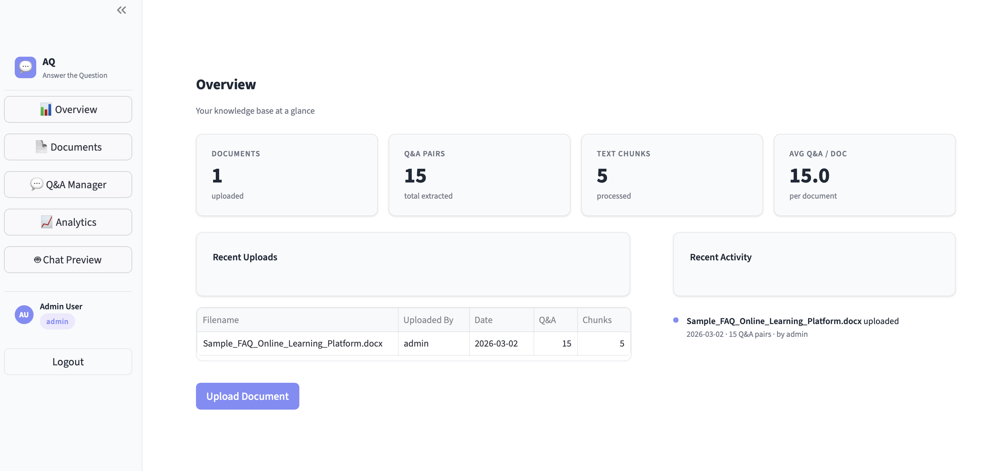
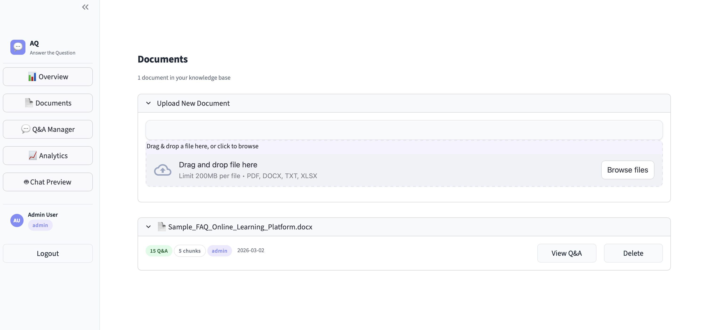
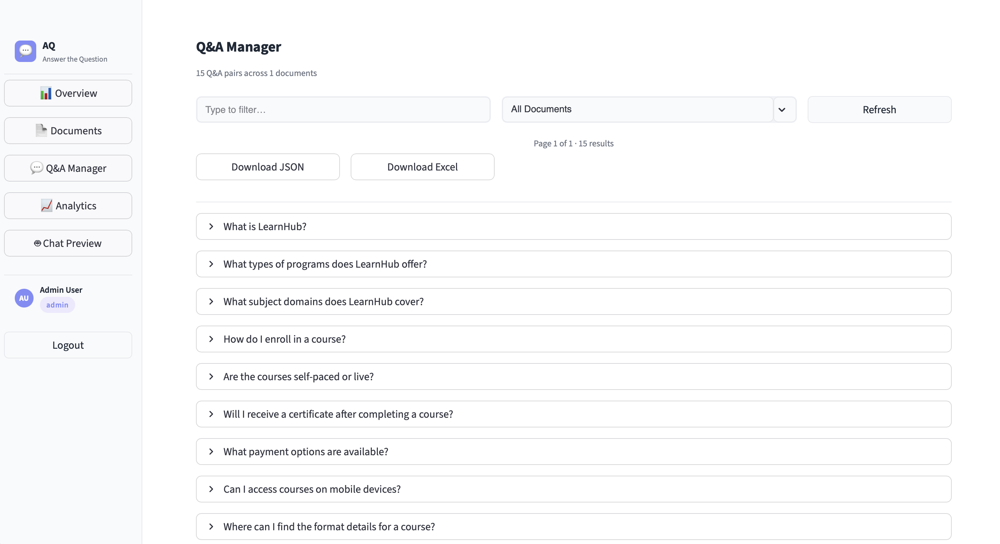
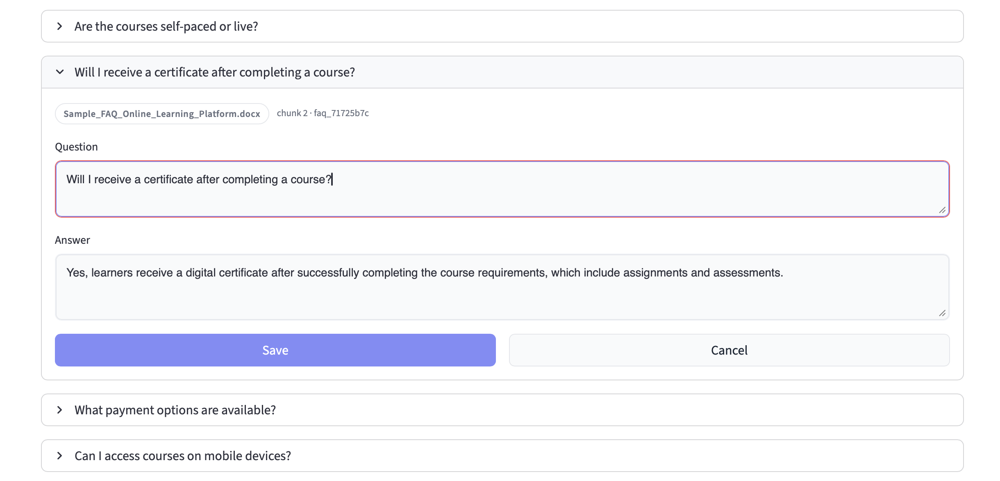
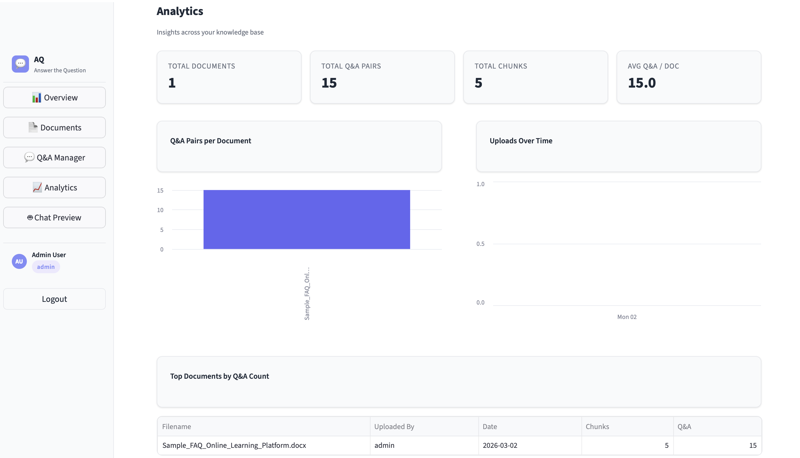
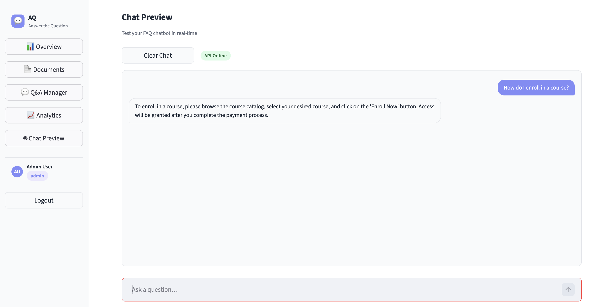
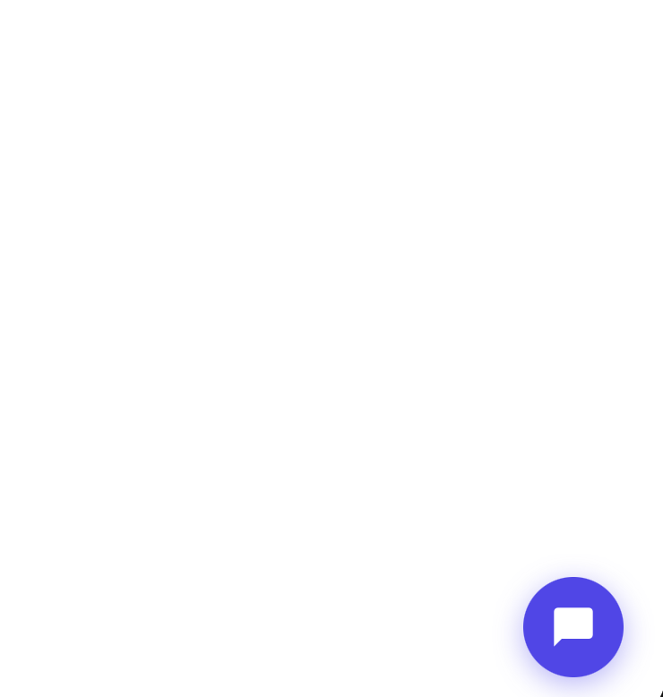

# AQ — Answer the Question

An end-to-end FAQ chatbot system with a **multi-page Admin Portal** for document ingestion and a **floating chat widget** that can be embedded into any webpage with a single `<script>` tag.

Each admin user gets an isolated knowledge base — the widget only answers from documents uploaded by the user whose `data-user-id` matches.

---

## Architecture

```
Admin Portal (Streamlit :8502)  — 5-page SaaS UI
  ├── Overview     → stats, recent uploads, activity feed
  ├── Documents    → upload + document library
  ├── Q&A Manager  → search, filter, paginate, edit, delete, download
  ├── Analytics    → charts + top-document table
  └── Chat Preview → live chat test with API health indicator

Chat API (FastAPI :8000)
  ├── POST /auth/login          → MongoDB user authentication
  ├── POST /chat                → filtered keyword search + Gemini answer
  ├── GET/POST/PUT/DELETE /faqs       → Q&A CRUD
  ├── GET/POST/DELETE   /documents    → document registry CRUD
  └── GET  /widget.js           → serves embeddable widget

MongoDB
  ├── users             → login credentials + roles (auto-seeded)
  ├── faqs              → Q&A pairs (each tagged with user_id)
  └── document_registry → uploaded document metadata

Any Webpage
  └── <script data-user-id="admin" ...>
      Widget sends user_id → backend filters FAQs by user_id
      Floating 💬 chat bubble (bottom-right)
```

---

## Tech Stack

| Layer | Technology |
|-------|-----------|
| LLM | Google Gemini — `gemini-2.5-flash` |
| Admin UI | Streamlit (multi-page, custom CSS) |
| Chat API | FastAPI + Uvicorn |
| Document Parsing | pdfplumber, python-docx, openpyxl |
| Auth | MongoDB (`users` collection) via FastAPI · 1-hour session TTL |
| Storage | MongoDB Atlas (FAQs + registry + users) |
| Multi-tenancy | `user_id` field on every FAQ document |
| Widget | Vanilla JS + Shadow DOM |

---

## Project Structure

```
FAQ-CHATBOT/
├── src/
│   ├── config.py               # Environment settings (Gemini + MongoDB)
│   ├── database.py             # MongoDB client + shared collections
│   ├── document_processor.py   # Extract + chunk text from documents
│   ├── qa_generator.py         # Gemini Q&A generation
│   ├── chat.py                 # Chat search + answer logic (filtered by user_id)
│   └── main.py                 # FastAPI app (all API endpoints)
├── ui/
│   └── admin.py                # Streamlit multi-page admin portal
├── public/
│   └── widget.js               # Embeddable floating chat widget
├── assets/                     # ← place screenshots here (see Admin Portal section)
├── floating_faq.html           # Test page for the chat widget
└── requirements.txt
```

---

## Setup

### 1. Create virtual environment

```bash
python -m venv .venv
source .venv/bin/activate      # macOS/Linux
.venv\Scripts\activate         # Windows
```

### 2. Install dependencies

```bash
pip install -r requirements.txt
```

### 3. Configure environment

Create a `.env` file in the project root:

```env
# Google Gemini
GEMINI_API_KEY=56ygza...

# MongoDB Atlas
MONGODB_URI=mongodb+srv://<user>:<password>@<cluster>.mongodb.net/?retryWrites=true&w=majority
MONGODB_DB=faq_chatbot
MONGODB_COLLECTION=faqs

# API URL (used by Streamlit to call FastAPI)
API_URL=http://localhost:8000
```

---

## Running

### Terminal 1 — Chat API

```bash
source .venv/bin/activate
uvicorn src.main:app --reload --port 8000
```

On first startup, default users are automatically seeded into MongoDB.

API docs: `http://localhost:8000/docs`

### Terminal 2 — Admin Portal

```bash
source .venv/bin/activate
streamlit run ui/admin.py --server.port 8502
```

Admin portal: `http://localhost:8502`

> **Note:** The FastAPI server must be running before opening the admin portal. If the backend is unreachable, the login page shows a clear error with the fix command.

---

## Admin Portal

The portal is a 5-page SaaS UI with a pinned sidebar, custom Inter-font theme, and 1-hour session TTL.

### Login

Credentials are verified via `POST /auth/login` against MongoDB. A connection error is shown with the exact fix command if the backend is down.

<!-- SCREENSHOT: Save as assets/login.png -->
> 

---

### Page 1 — Overview

Landing page after login. Shows:
- **4 stat cards** — Documents, Q&A Pairs, Text Chunks, Avg Q&A per Doc
- **Recent Uploads** table — last 8 documents
- **Recent Activity** feed — timestamped upload events

<!-- SCREENSHOT: Save as assets/overview.png -->
> 

---

### Page 2 — Documents

Upload and manage source documents.

- Drag-and-drop file uploader (PDF, DOCX, TXT, XLSX)
- Click **Extract Q&A** → document is chunked → Gemini generates Q&A → saved to MongoDB tagged with `user_id`
- Each document card shows Q&A count, chunk count, uploader badge, and date
- **View Q&A** navigates directly to the Q&A Manager filtered to that document
- **Delete** opens a confirmation dialog and removes the document + all its Q&A

<!-- SCREENSHOT: Save as assets/documents.png -->
> 

---

### Page 3 — Q&A Manager

Full Q&A browser across all documents.

- **Search** — filter by keyword across all questions
- **Filter by document** — dropdown to scope to one source file
- **Pagination** — 20 Q&A pairs per page with Previous / Next controls
- **Inline edit** — click Edit to open a text area form; Save calls `PUT /faqs/{faq_id}`
- **Delete** — confirmation prompt; calls `DELETE /faqs/{faq_id}`
- **Download** — export current view as JSON or Excel (.xlsx)

<!-- SCREENSHOT: Save as assets/qa_manager.png -->
> 

<!-- SCREENSHOT: Inline edit form open. Save as assets/qa_edit.png -->
> 

---

### Page 4 — Analytics

Charts and stats across your knowledge base.

- Summary metrics (Documents, Q&A Pairs, Chunks, Avg Q&A/Doc)
- **Bar chart** — Q&A pairs per document
- **Line chart** — uploads over time
- **Top documents** table sorted by Q&A count
- Most active uploader callout

<!-- SCREENSHOT: Save as assets/analytics.png -->
> 

---

### Page 5 — Chat Preview

Test your chatbot live without leaving the admin portal.

- **API health badge** — shows Online / Offline status of the FastAPI backend
- Chat window renders user + bot bubbles
- Calls `POST /chat` with the logged-in user's `user_id` so you only see your own documents
- **Clear Chat** button resets the conversation

<!-- SCREENSHOT: Save as assets/chat_preview.png -->
> 

---

## Chat Widget

### Embed in any webpage

```html
<script
  src="http://localhost:8000/widget.js"
  data-api="http://localhost:8000"
  data-user-id="admin">
</script>
```

Paste into `<head>` or before `</body>`. A floating 💬 bubble appears in the bottom-right corner.

### Widget attributes

| Attribute | Required | Description |
|-----------|----------|-------------|
| `data-api` | Yes | Base URL of the FastAPI server |
| `data-user-id` | Recommended | Username whose documents to search. Omit to search all users. |

<!-- SCREENSHOT: Widget bubble. Save as assets/widget_bubble.png -->
> 

<!-- SCREENSHOT: Widget chat open. Save as assets/widget_chat.png -->

> 

---

## How the Chat Works

```
User types a question
        ↓
POST /chat  { message, user_id: "admin" }
        ↓
MongoDB: faqs.find({ user_id: "admin" })
        ↓
Keyword scoring → top 4 relevant Q&A selected
        ↓
Google Gemini generates a grounded answer
        ↓
Reply shown in widget / Chat Preview
```

---

## Multi-Tenancy (Per-User Isolation)

Every FAQ stored in MongoDB has a `user_id` field matching the uploader's username.

```
Admin "alice" uploads → FAQs stored with  user_id: "alice"
Admin "bob"   uploads → FAQs stored with  user_id: "bob"

Widget with data-user-id="alice" → only searches alice's FAQs
Widget with data-user-id="bob"   → only searches bob's FAQs
Widget with no data-user-id      → searches all FAQs (no filter)
```

---

## Managing Admin Users

Users live in MongoDB's `users` collection. Add new users with:

```js
// MongoDB Shell
db.users.insertOne({
  username: "yourname",
  password: "yourpassword",
  role: "admin",         // "admin" or "editor"
  name: "Your Full Name"
})
```

---

## API Reference

| Method | Endpoint | Description |
|--------|----------|-------------|
| `POST` | `/auth/login` | Verify credentials, return user record |
| `POST` | `/chat` | Send a question, get an answer (filtered by `user_id`) |
| `GET` | `/faqs` | List Q&A pairs (`?stem=` and/or `?user_id=`) |
| `POST` | `/faqs/bulk` | Replace all Q&A for a document stem |
| `PUT` | `/faqs/{faq_id}` | Update a Q&A pair |
| `DELETE` | `/faqs/{faq_id}` | Delete a Q&A pair |
| `GET` | `/documents` | List document registry |
| `POST` | `/documents` | Upsert a document record |
| `DELETE` | `/documents/{stem}` | Delete document and all its Q&A |
| `GET` | `/widget.js` | Serve the embeddable widget script |
| `GET` | `/health` | Liveness check |

### POST /chat

**Request:**
```json
{ "message": "What is your refund policy?", "user_id": "admin" }
```

**Response:**
```json
{ "reply": "We offer a 30-day money-back guarantee..." }
```

### POST /auth/login

**Request:**
```json
{ "username": "admin", "password": "admin123" }
```

**Response:**
```json
{ "username": "admin", "role": "admin", "name": "Admin User" }
```
